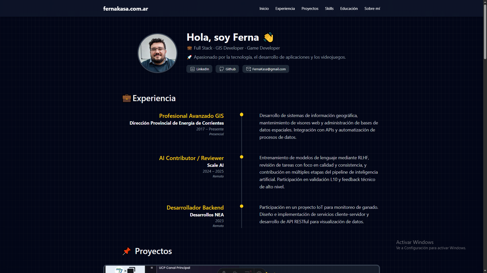
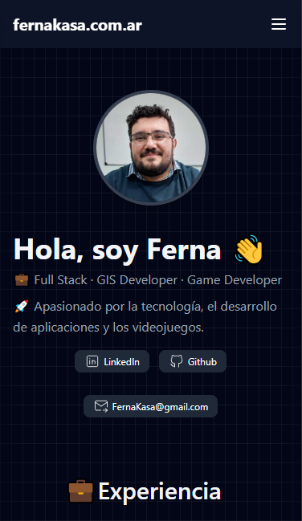

# FGS Portfolio CV

Este es mi portfolio personal desarrollado con [Astro](https://astro.build/) y [Tailwind CSS](https://tailwindcss.com/). Aquí presento mi experiencia, proyectos destacados y habilidades técnicas.

## 🚀 Tecnologías Utilizadas

- Astro
- Tailwind CSS
- Iconos personalizados en formato `.astro`
- Componente de imagen optimizado (`<Image />`)

## 📁 Estructura del Proyecto

- `/src/components`: Componentes reutilizables como `Badge.astro`, `SocialPill.astro`, etc.
- `/src/pages`: Páginas principales del sitio.
- `/public`: Recursos estáticos como imágenes y fuentes.

## 📷 Capturas de Pantalla

 

## 🛠️ Instalación y Desarrollo

```bash
npm install
npm run dev
```
